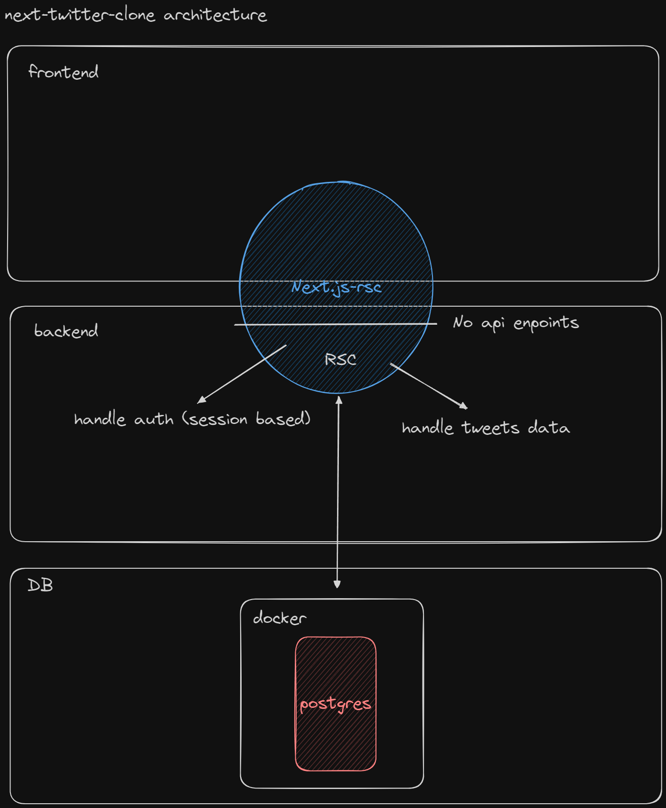

###  Getting started
```bash
# run the script
./start-build.sh [-dev|-build]
```
---
### Folder structure
```bash
/src
 |- /app
    |- page.tsx
    |- layout.tsx
    |- loading.tsx
    |- error.tsx
    |- /sample-page
        |- page.tsx
        |- loading.tsx
        |- error.tsx
        |- /_components
        |- /_actions
        |- /_hooks
        |- /@sample-parallel
            |- page.tsx
            |- loading.tsx
            |- error.tsx
            |- /(..)sample-intercepting
                |- page.tsx
                |- loading.tsx
                |- error.tsx
    |- /sample-page
        |- /[slug]
            |- page.tsx
 |- /server
     |- db.ts
 |- /shared
    |- /_shacdn
    |- /_styles
    |- /_hooks
    |- /_actions
    |- /_components
    |- /_icons
```


